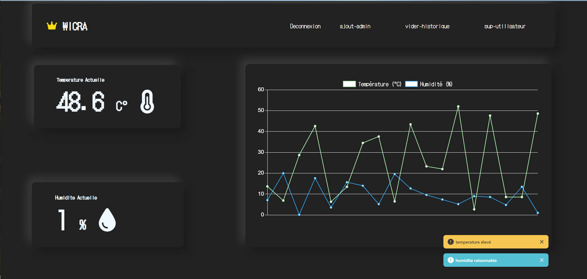

# Projet IoT - Surveillance de salle de serveurs

Développé lors de notre formation en BTS CIEL IR au lycée César Baggio, ce projet propose un système de surveillance environnementale pour une salle de serveurs, répondant aux besoins fictifs de l'entreprise Nomios.

---

### Interface

---

### Contexte & Besoin client

Nomios, une entreprise spécialisée en sécurité informatique, a une salle de serveurs avec des équipements précieux. Maintenir des conditions environnementales stables est crucial pour éviter les pannes et les dommages matériels.

Surveiller en temps réel les paramètres de la salle de serveurs est nécessaire pour éviter les pannes et les dommages. L'administrateur doit être alerté immédiatement en cas de problème critique.

### Participants au projet

- **Moi** : Responsable de la partie Web Back & Front.
- **Reine** : Responsable de la partie [ESP & DHT](./esp&dht/esp8266_https.ino).
- **Elias** : Responsable de la partie Broker (MQTT).